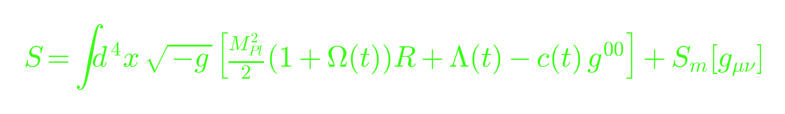

<div align="center">

# Hi, I'm 


</div>

<!-- <p align="center"></p> -->

<p align="center">
  <a href="https://vianielson.substack.com"></a>
  <a href="https://www.linkedin.com/in/vianie/"></a>
  <a href="https://orcid.org/0000-0001-8119-9098"></a>
  <a href="https://www.buymeacoffee.com/0vianie"></a>
  
</p>

```text
                                    via@physics
                                    ─────────────────────────────
          -----                    OS: Spacetime (3+1D, mostly flat)
         /     \                   Host: University of Washington
    ----(   *   )----              Kernel: General Relativity 4.0
         \     /                   Uptime: PhD Year 3
          -----                    Shell: python3 / bash / latex
                                    Field: Theoretical Physics
                                    Focus: Particle Theory — Astro,
                                           Cosmology & Gravitation
                                    Framework: EFT of Dark Energy
                                    Tested against: CMB, LSS
```

<p align="center"></p>

```diff
+ $ cat about.py
```

```python
class Via:
    def __init__(self):
        self.role = "PhD Student, Theoretical Physics"
        self.focus = "Particle Theory — Astrophysics, Cosmology & Gravitation"
        self.framework = "Effective Field Theory of Dark Energy (EFTofDE)"
        self.mission = (
            "Model-independent exploration of cosmic acceleration by "
            "parameterizing modifications to General Relativity through "
            "a finite set of time-dependent functions."
        )
        self.method = (
            "Focus on the symmetries of the cosmological background and "
            "the relevant low-energy degrees of freedom to unify diverse "
            "theories into a single testable mathematical language."
        )
        self.tested_against = ["CMB", "Large Scale Structure"]

    @property
    def education(self) -> list[str]:
        return [
            "PhD, Physics — University of Washington (in progress)",
            "MSc, Physics — University of Washington",
            "MSc, Physics — Perimeter Institute of Theoretical Physics",
            "BSc, Astronomy & Astrophysics — University of Michigan",
        ]

via = Via()
```

<p align="center"></p>

<p align="center">
  
</p>

<p align="center"></p>

<details>
<summary><b>Publications</b></summary>
<br>

- **Optical and X-ray GRB Fundamental Planes as cosmological distance indicators** — *Monthly Notices of the Royal Astronomical Society*, 2022. [[arXiv:2203.15538]](https://arxiv.org/abs/2203.15538) [[DOI]](https://doi.org/10.1093/mnras/stac1141)
- **A new perspective on cosmology through Supernovae Ia and Gamma Ray Bursts** — *The Sixteenth Marcel Grossmann Meeting*, 2021. [[arXiv:2110.11930]](https://arxiv.org/abs/2110.11930) [[DOI]](https://doi.org/10.1142/9789811269776_0256)
- **An Experimental Study: Assessing the Combined Framework of WavLM and BEST-RQ for Text-to-Speech Synthesis** — *arXiv*, 2023. [[arXiv:2312.05415]](https://arxiv.org/abs/2312.05415) [[DOI]](https://doi.org/10.48550/arXiv.2312.05415)

</details>

<p align="center"></p>

```diff
+ $ tail -f substack.log
```

<!-- BLOG-POST-LIST:START -->
- [All Them Infinities](https://vianielson.substack.com/p/all-them-infinities) — 2026-08-12 23:10:19
- [Group Theory Crash Course](https://vianielson.substack.com/p/group-theory-crash-course) — 2026-08-12 17:46:12
- [How to Accidentally Invent the Photon](https://vianielson.substack.com/p/how-to-accidentally-invent-the-photon) — 2026-08-12 00:12:48
- [The Story of QFT](https://vianielson.substack.com/p/the-story-of-qft) — 2025-11-25 05:11:25
- [Black Holes Can Superconduct](https://vianielson.substack.com/p/black-holes-can-superconduct) — 2025-10-19 21:21:28
<!-- BLOG-POST-LIST:END -->

<p align="center"></p>

```diff
+ $ ls stack/
```

<p align="center">
  
  
  
  
  
  
  
</p>

<p align="center"></p>

<!-- <p align="center">
  
  
</p> -->

<p align="center">
  
</p>

<p align="center"></p>

```diff
+ $ echo "thanks for stopping by — via"
```
